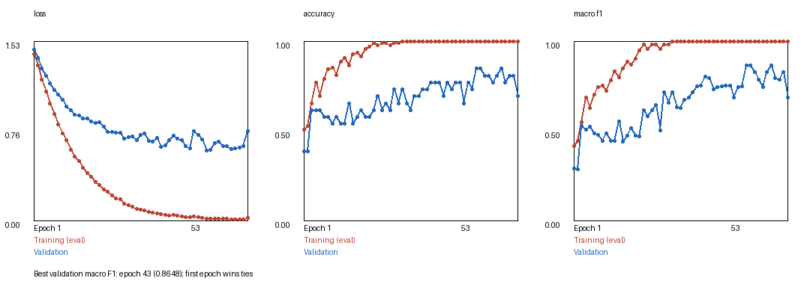
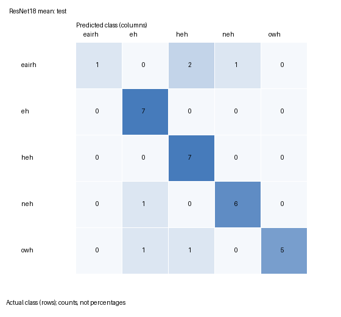

# Mazdas: Baby Cry Classification

A five-class PyTorch prototype using **intermediate fusion** of audio spectrograms
and video-frame features. The complete workflow lives in **[mazdas.ipynb](mazdas.ipynb)**:
data checks, preprocessing, training, validation, evaluation, plots, and prediction.
No separate preparation or training scripts are required.

This is an academic experiment that predicts dataset labels, **not a medical tool
or a validated translation of a baby's needs**.

## Package Layout

```text
mazdas.ipynb
eairh/
eh/
heh/
neh/
owh/
results/
  prepared/      # Cached features, exact split manifest, and input previews
  mean/          # Mean-pooling checkpoint, history, metrics, and plots
  attention/     # Attention checkpoint, history, validation metrics, and plots
  dataset_sha256.json
  environment.json
```

Each class directory contains `data_train_video/` and `data_test_video/`.
Validation is selected internally from training; no validation folder is needed.
The five folders contain **153 videos**, split into **95 training, 26 validation,
and 32 test samples** for the recorded experiment. The `eairh` manifest preserves
the recurring-shot groups and training-only restrictions.

| Label | Meaning used by the dataset |
| --- | --- |
| `eairh` | Lower abdominal discomfort |
| `eh` | Needs burping |
| `heh` | Discomfort |
| `neh` | Hungry |
| `owh` | Sleepy / tired |

## Open the Notebook

1. Clone or download the complete repository, including the videos and `results/`.
2. Open `mazdas.ipynb` in Jupyter or Google Colab.
3. Set `ROOT` in the first code cell to the directory containing the notebook and
   all five dataset folders. Locally, `Path.cwd()` works when the kernel starts there.
4. Run the cells in order.

For Colab, upload/unzip the complete package into Google Drive, mount Drive using
Colab's Files panel, and set a path such as
`ROOT = Path('/content/drive/MyDrive/mazdas')`.

**By default, Run All reviews the supplied results without training or evaluating
the test set again.** The notebook displays preprocessing previews, training curves,
validation comparisons, and the recorded test metrics and confusion matrix.

### Requirements

The recorded runs used Python 3.13 on CPU. Exact PyTorch, TorchVision, TorchAudio,
NumPy, and Pillow versions are recorded in `results/environment.json`. Use a
compatible Jupyter/IPython kernel. The optional installation cell can install the
recorded package versions; restart the kernel afterward. Results may differ on
other environments or devices.

Fresh preprocessing and prediction from a video require **FFmpeg and ffprobe on
PATH**. Reviewing saved results does not require decoding videos. ImageNet ResNet18
weights are downloaded on first use for fresh preparation or video prediction.

## Reproduce Training

The configuration cell exposes these switches:

| Setting | Default | Purpose |
| --- | --- | --- |
| `REBUILD_FEATURES` | `False` | Recompute audio/video features from the videos |
| `RUN_TRAINING` | `False` | Train both mean and attention pooling models |
| `RUN_TEST_EVALUATION` | `False` | Evaluate only the validation-selected model |
| `RUN_ROOT` | `ROOT / 'runs' / 'resnet18_reproduction'` | Separate location for new outputs |

For full reproduction, set `REBUILD_FEATURES = True` and `RUN_TRAINING = True`,
then run the notebook in order. Alternatively, leave feature rebuilding disabled
to train using the supplied cache. Choose a fresh `RUN_ROOT` for each experiment;
existing features and training directories are not silently overwritten.

Keep test evaluation disabled while making model decisions. Only enable it after
the experiment is fixed and a model has been selected by validation. The notebook
refuses to overwrite an existing test result. Never use test results to choose
checkpoints, tune settings, or select between models.

The notebook's fresh preparation and both training runs were checked in the
recorded environment and reproduced the saved validation metrics and best epochs
exactly. This is a reproducibility check, not an independent evaluation.

## Model and Preprocessing

**One clip produces one paired sample**, using the same first up to four seconds
in both modalities. Audio and its spectrogram are one modality, not two branches.

- **Audio:** 16 kHz mono waveform, 64-band log-mel spectrogram, FFT size 512,
  hop length 160, per-clip standardization, and resizing to `(1, 64, 128)`.
  A small trainable CNN produces a 128-dimensional feature vector.
- **Video:** up to eight evenly spaced frames, conservative shared black-edge
  removal, aspect-preserving resizing, and neutral padding. Frozen ImageNet
  **ResNet18** produces a 512-dimensional embedding per frame.
- **Pooling:** either a masked mean or a small learned frame-attention scorer.
  Padding is excluded. A linear projection produces 128 video features.
- **Fusion:** concatenate audio and video features, apply dropout `0.4`, and
  classify into five classes.

Attention weights frames; it is not cross-modal attention or an explicit motion
model. `best.pt` stores the trained fusion network, not the frozen ImageNet backbone.
The notebook loads the appropriate backbone separately for raw-video prediction.

Both runs use AdamW, learning rate `0.001`, weight decay `0.01`, batch size `16`,
seed `42`, and four CPU threads. Training allows up to **100 epochs**, with early
stopping after **10 epochs without a strictly higher validation macro F1**.
The best checkpoint is retained; ties keep the earliest epoch.

## Recorded Results

### Validation Comparison

| ResNet18 pooling | Best epoch | Stopped at | Accuracy | Macro F1 | Eairh recall |
| --- | --- | --- | --- | --- | --- |
| **Mean** | 43 | 53 | **84.62% (22/26)** | **0.86476** | 2/2 |
| Attention | 40 | 50 | 80.77% (21/26) | 0.78029 | 1/2 |

Mean pooling was selected using validation results, before test evaluation.

### Selected Mean Model: Test

**Accuracy: 81.25% (26/32). Macro F1: 0.75780.**

| Class | Correct / total | Recall |
| --- | --- | --- |
| `eairh` | 1/4 | 25.0% |
| `eh` | 7/7 | 100.0% |
| `heh` | 7/7 | 100.0% |
| `neh` | 6/7 | 85.7% |
| `owh` | 5/7 | 71.4% |

Macro F1 averages per-class F1 equally, so weak performance on a small class is
not hidden by larger classes. Attention was not evaluated on test to pick a winner.

- [Test metrics](results/mean/test_metrics.json)
- [Mean training summary](results/mean/training_summary.json)
- [Attention training summary](results/attention/training_summary.json)





## Limitations and Data Permissions

- The test set contains only 32 clips; one error changes accuracy by 3.125
  percentage points. Eairh has only two validation examples and four test examples.
- Eairh uses a provisional within-DVD recurring-shot split. Source and infant
  independence across splits/classes are not established.
- Two current eairh test clips were used for validation in earlier experiments.
  This is not a historically untouched external benchmark.
- The earlier 85.7% result used four classes and 28 test clips. It is not directly
  comparable to this five-class experiment with a changed dataset and split.
- The 81.25% overall accuracy does not resolve the weak 25% eairh test recall.
  No external validation on new babies, phones, or environments has been done.
- Source media permissions are not established by this repository. No license
  to redistribute the infant footage is granted here. Confirm the required rights
  and permissions before sharing, publishing, or deploying with this data.

## References

- [TorchVision ResNet18](https://docs.pytorch.org/vision/stable/models/generated/torchvision.models.resnet18.html)
- [TorchAudio MelSpectrogram](https://docs.pytorch.org/audio/stable/generated/torchaudio.transforms.MelSpectrogram.html)
