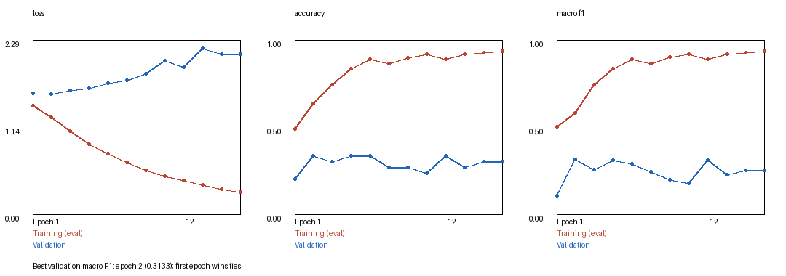
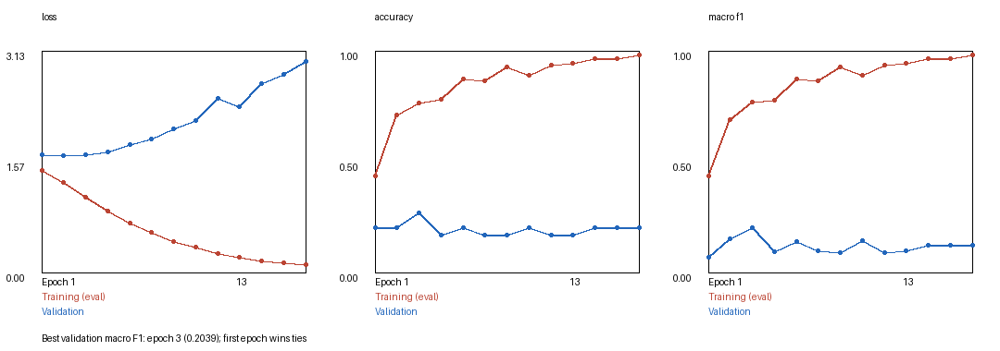

# Mazdas: Multimodal Baby Cry Classification

Mazdas investigates five-class baby cry classification using **intermediate fusion
of audio spectrograms and video features**. The experiment compares mean pooling
with squeeze-and-excitation (SE) channel recalibration followed by temporal attention,
using a frozen ResNet18 visual backbone and a trainable audio CNN.

[mazdas.ipynb](mazdas.ipynb) contains the complete preparation, training, evaluation,
and inference workflow. This research prototype predicts dataset labels; it is not
a clinically validated interpretation of an infant's needs.

## Dataset

The dataset contains **175 audiovisual clips**, with 35 per category. Assigned
meanings describe the annotation scheme, not medically verified causes.

| Label | Assigned meaning | Training | Validation | Test |
| --- | --- | ---: | ---: | ---: |
| `eairh` | Lower abdominal discomfort | 22 | 6 | 7 |
| `eh` | Needs burping | 22 | 6 | 7 |
| `heh` | Discomfort | 22 | 6 | 7 |
| `neh` | Hungry | 22 | 6 | 7 |
| `owh` | Sleepy / tired | 22 | 6 | 7 |
| **Total** | | **110** | **30** | **35** |

Each category has two physical folders: `data_train_video/` contains 28 clips and
`data_test_video/` contains 7. Six training-folder clips are reserved internally
for validation. Class-level `split_manifest.json` files record the assignments.

Footage is primarily drawn from Dunstan Baby Language instructional recordings,
with an additional short-video source for `eairh`. The 35 `eairh` clips were
segmented using audio energy and pauses, averaging approximately 1.57 seconds.
Boundaries have not been individually verified by listening. Seven brief or
low-energy candidates are flagged in [the clip review](eairh/review.html).

### Overlap Screening

Known duplicate and overlapping cuts are confined to training. An audio screen
examined all **8,200 cross-split pairs**, including cross-class pairs, using normalized
cross-correlation at 8 kHz. No absolute correlation above 0.85 was detected for
alignments spanning at least 250 ms and 75% of the shorter clip.

This does **not** establish source or infant independence. Shared recordings cross
splits; shorter overlaps or transformed duplicates may evade detection. See
[the audit](AUDIT.md) and [screening evidence](results/audit/verification.json).

## Method

**One clip is one paired sample.** Both modalities use the same first up to four
seconds. Audio and its spectrogram form a single modality.

- **Audio:** 16 kHz mono, 64-band log-mel spectrogram, FFT size 512, hop length 160,
  per-clip standardization, and resizing to `(1, 64, 128)`. A small CNN produces
  a 128-dimensional embedding.
- **Video:** up to eight evenly spaced frames, conservative black-edge cropping,
  and aspect-preserving resizing with padding. Frozen ImageNet-pretrained
  ResNet18 produces 512 features per frame.
- **Mean pooling:** average valid frame embeddings, excluding padding.
- **SE-attention pooling:** use a masked temporal mean and a 512 -> 32 -> 512
  ReLU/sigmoid network to recalibrate channels, followed by a learned temporal
  attention scorer. Invalid logits are masked before softmax.
- **Intermediate fusion:** project pooled video features to 128 dimensions,
  concatenate with the audio embedding, apply dropout 0.4, and classify into
  five categories.

SE scales visual channels and temporal attention weights frames. Neither implements
cross-modal attention or explicit motion estimation. The audio CNN, video projection,
classifier, and attention modules are trainable; ResNet18 remains frozen.

## Experimental Protocol

| Parameter | Setting |
| --- | --- |
| Optimizer | AdamW |
| Learning rate | 0.001 |
| Weight decay | 0.01 |
| Batch size | 16 |
| Maximum epochs | 100 |
| Early stopping | 10 epochs without validation macro F1 improvement |
| Checkpoint selection | Highest validation macro F1; earliest epoch breaks ties |
| Random seed | 42 |
| Execution | CPU, four threads |

Macro F1 averages the five per-class F1 scores equally. Model selection uses
validation macro F1, not test performance. Results represent one split and one
seed, rather than repeated trials or cross-validation.

## Results

| Pooling | Best epoch | Validation macro F1 | Test accuracy | Test macro F1 |
| --- | ---: | ---: | ---: | ---: |
| **Mean (validation-selected)** | 2 | **0.313** | 28.57% (10/35) | 0.2400 |
| SE + temporal attention | 3 | 0.204 | **62.86% (22/35)** | **0.6187** |

Mean pooling satisfies the validation-based selection criterion. SE-attention
achieves higher test performance but lower validation performance. The reversal
remains unexplained, and this experiment does not establish that either method
generalizes better. Both test results are an **exploratory comparison**, not grounds
for selecting attention after inspecting the test set.

- [Mean validation metrics](results/current_175/mean/validation_metrics.json)
- [Mean test metrics](results/current_175/mean/test_metrics.json)
- [SE-attention validation metrics](results/current_175/attention/validation_metrics.json)
- [SE-attention test metrics](results/current_175/attention/test_metrics.json)





Validation and test metrics were reproduced from the supplied checkpoints.
Ten raw-video preprocessing checks matched cached features. These checks verify
artifact consistency, not performance on independent data.

## Running the Experiment

Download the notebook, videos, and results **from the same repository revision**.
Downloading just the notebook or combining it with a separate Drive dataset does
not reproduce this experiment. A fresh clone is the simplest starting point:

```sh
git clone https://github.com/rieyza21/mazdas.git
cd mazdas
python verify_release.py
```

The verification command requires Python 3.11 or newer but no ML packages. It
checks video paths against the split manifest without reading or hashing video
contents. For training use
the Python 3.13 environment described below. When downloading a ZIP instead,
fully extract it and open the notebook from the resulting `mazdas-main` directory.

For Google Colab, clone into the runtime rather than combining notebook and
dataset downloads from different locations:

```python
!git clone https://github.com/rieyza21/mazdas.git /content/mazdas
!python /content/mazdas/verify_release.py
```

The notebook automatically discovers `/content/mazdas` from `/content`.
Cloning supplies data and results, not Python dependencies; Colab's runtime must
still provide a compatible stack as noted below. Restart the kernel and run
cells in order after replacing a dataset download.

Keep `mazdas.ipynb`, the five category folders, and `results/` together. Open the
notebook from the extracted project folder. It searches the working directory,
its parents, and immediate child folders for the dataset, with no machine-specific
path to edit. If multiple copies exist, open it from the intended folder. It does
not scan an entire disk or Google Drive; use the clone workflow above for Colab.

Python 3.13 and CPU execution were used for the supplied experiments. Package
versions are recorded in [environment.json](results/environment.json). A compatible
PyTorch, TorchVision, TorchAudio, and Jupyter environment is required. Preprocessing
and raw-video inference also require **FFmpeg and ffprobe** on PATH. ImageNet
weights are downloaded on first use.

### Installation (Windows / PowerShell)

From the repository directory, use Python 3.13 to create a dedicated environment:

```powershell
py -3.13 -m venv .venv
.venv\Scripts\python -m pip install --upgrade pip
.venv\Scripts\python -m pip install -r requirements.txt
.venv\Scripts\python -m pip check
.venv\Scripts\python -m ipykernel install --user --name mazdas --display-name "Mazdas (Python 3.13)"
ffmpeg -version
ffprobe -version
```

[requirements.txt](requirements.txt) pins the recorded numerical libraries and
notebook execution packages, including CPU PyTorch wheels. It does not install
the FFmpeg executable or a notebook editor. Install FFmpeg separately and add its
binary directory to PATH. Open the notebook in a Jupyter-compatible editor and
select **Mazdas (Python 3.13)**. For a browser interface, optionally install and
launch JupyterLab using this environment:

```powershell
.venv\Scripts\python -m pip install jupyterlab
.venv\Scripts\python -m jupyterlab
```

These pins target the recorded Windows CPU setup. Other platforms, including
Colab, may require a different compatible PyTorch stack and are not guaranteed
to reproduce identical numbers. Direct dependencies are pinned; this is not a
complete transitive dependency lock or a guarantee of bit-for-bit training results.

By default, running all cells checks dataset integrity and displays saved results;
it does not train or reevaluate the test set.

| Notebook setting | Default | Purpose |
| --- | --- | --- |
| `REBUILD_FEATURES` | `False` | Extract audio and video features |
| `RUN_TRAINING` | `False` | Train both pooling variants |
| `RUN_TEST_EVALUATION` | `False` | Evaluate the validation-selected model |
| `RUN_ROOT` | `ROOT / 'runs' / 'resnet18_reproduction'` | Output directory |

For training, enable both `REBUILD_FEATURES` and `RUN_TRAINING` and choose an unused
`RUN_ROOT`. Keep test evaluation disabled until all model decisions are fixed.
The workflow refuses to overwrite existing feature caches, training directories,
or test results.

The notebook's 22 cells have been executed successfully in saved-results mode.
Full training through the notebook has not been independently repeated for this
experiment. Device, library, and decoder differences may affect reproducibility.

### Repository Contents

```text
mazdas.ipynb                 Complete experimental workflow
eairh/, eh/, heh/, neh/, owh/ Dataset folders and split manifests
results/current_175/         Features, checkpoints, metrics, and plots
results/audit/               Machine-readable verification evidence
verify_release.py           Optional dataset layout check (no hashing)
AUDIT.md                    Detailed methodological review
```

`results/previous_dataset/` retains a separate 153-clip experiment for provenance.
Its reported 81.25% accuracy was obtained with duplicate/subclip contamination
across splits and is not a valid generalization benchmark or a direct comparison
with the experiment above.

## Limitations

### Dataset Integrity Errors

If verification reports missing or unexpected videos, compare the listed paths
with `ROOT`. Common causes are an incomplete download, nested extraction folders,
incorrect folder names/case, or mixing files from different dataset revisions.
Use a fresh clone in a separate directory; do not delete personal files to repair
a download. SHA-256 verification is not part of the workflow. Files replaced or
modified under the same names are not detected, so changing video contents requires
fresh feature preparation and training. Recorded metrics apply only to the supplied
experiment, not to replacement media. Historical audit fingerprints are provenance
records only and are not enforced by the notebook.

### Research Limitations

- Only 35 test clips are available; one error changes accuracy by 2.86 percentage
  points. Segmented clips are not independent infants or recordings.
- Source and infant independence are unverified. Visual context, repeated scenes,
  and class-specific duration differences may act as shortcuts.
- Cry labels and automatic `eairh` boundaries need further human verification.
- Both test outcomes have been inspected, and some source excerpts participated
  in earlier development. Further tuning requires a fresh independent evaluation
  set to support an unbiased final performance claim.
- No external validation across new babies, phones, or environments has been
  performed. The model is not suitable for medical or caregiving decisions.

## Data Permissions

This repository does not establish redistribution rights for the source footage
or grant a license to share infant videos. Confirm the necessary permissions
before publishing or redistributing the dataset.
